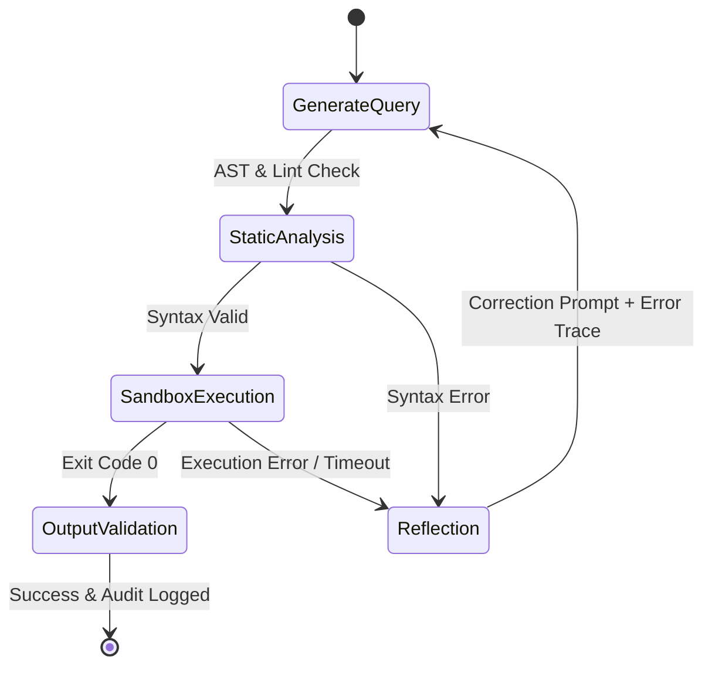

# Self-Correcting Code & SQL Agent (LangGraph + Python AST)

An autonomous software engineering agent that writes, tests, executes, and iteratively debugs Python and Snowflake SQL queries inside an isolated sandbox using LangGraph cyclic execution and reflection loops.

---

## 🏛️ Cyclic Self-Correction State Machine

---

## 🚀 Key Technical Highlights
- **Cyclic Graph with Hard Recursion Limits:** Maximum 3 self-correction iterations preventing infinite token consumption.
- **Deterministic AST Verification:** Validates Python AST and SQL tokens before execution to reject forbidden calls (`os.system`, `DROP TABLE`).
- **State Reducers with Pydantic:** Strict state management storing stdout, stderr, execution traces, and patch diffs.
- **FastAPI Async Engine:** REST endpoint for enterprise developer tooling integration.

---

## 🛠️ Tech Stack
- **Orchestration:** LangGraph, LangChain
- **Analysis:** Python `ast`, `ruff`, SQLGlot
- **Runtime:** Docker Container Sandbox, FastAPI
